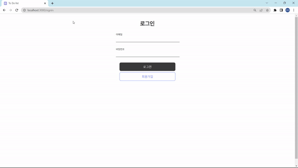
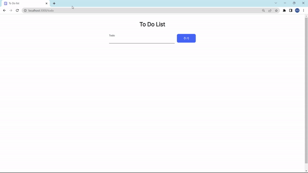

# wanted-pre-onboarding-frontend
원티드 프리온보딩 프론트엔드 - 선발 과제

## 지원자
주대선

## 프로젝트 폴더구조
```
.
├── App.js
├── apis
│   ├── instance.js                 // axios default 설정
│   ├── auth.js                     // 회원 관련 api
│   └── todo.js                     // todo 관련 api
├── components
│   ├── BtnBox.jsx                  // 버튼 컴포넌트
│   ├── InputLine.jsx               // 입력창 컴포넌트
│   └── TodoListItem.jsx            // todo 컴포넌트
├── pages
│   ├── SigninPage.jsx              // 로그인 페이지
│   ├── SignupPage.jsx              // 회원가입 페이지
│   └── TodoPage.jsx                // todo 페이지
├── index.tsx
└── globalStyles.js                 // 전역 스타일
```

## 프로젝트 실행 방법
```
$ git clone https://github.com/eosun77/wanted-pre-onboarding-frontend.git
$ cd wanted-pre-onboarding-frontend
$ npm install
$ npm start
```

## 기능 구현

### 🔐 인증/인가
- SigninPage.jsx  
```js
const handleSignin = () => {
  signin(email, password)
    then((res) => {
      console.log(res);
      alert("로그인 성공");
      localStorage.setItem("accessToken", res.data.access_token); // 로그인 성공시 로컬 스토리지에 토큰 저장
      navigate("/todo");
    })
    .catch((err) => {
      console.log(err);
      alert("로그인 실패");
    });
};
```
- App.js
```js
// 로그인이 필요한 페이지
function PrivateRoute({ children }) {
  const accessToken = localStorage.getItem("accessToken");

  if (accessToken) {
    axiosInstance.defaults.headers.common[
      "Authorization"
    ] = `Bearer ${accessToken}`;
    return children;
  } else {
    return <Navigate to="/signin" replace />;
  }
}

function PublickRoute({ children }) {
  const accessToken = localStorage.getItem("accessToken");

  if (accessToken) {
    return <Navigate to="/todo" replace />;
  } else {
    return children;
  }
}
```

### ✏️ Create (todo 추가)
- TodoPage.jsx
```js
const handleCreateTodo = () => {
  createTodo(todoInput)
    .then((res) => {
      console.log(res);
      alert("추가 완료");
      setTodoList([...todoList, res.data]);
      setTodoInput("");
    })
    .catch((err) => {
      console.log(err);
      alert("추가 실패");
    });
};
```

### 📖 Read (todo 읽기)
- TodoPage.jsx
```js
useEffect(() => {
  getTodos()
    .then((res) => {
    console.log(res);
    setTodoList(res.data);
  })
  .catch((err) => {
    console.log(err);
    alert("To Do List를 불러오는데 실패했습니다.");
  });
}, []);
```

### 🔄 Update (todo 수정)
- TodoPage.jsx
```js
// 체크박스 수정
const handleClickCheckBox = (todo) => {
  updateTodo(newTodo)
    .then((res) => {
      console.log(res);
      alert("수정 완료");
      const newTodo = {
        ...todo,
        isCompleted: !todo.isCompleted,
      };
      const todoId = todo.id;
      const updatedTodoList = todoList.map((todo) => {
        if (todo.id === todoId) {
          return newTodo;
        }
        return todo;
      });
  
      setTodoList(updatedTodoList);
    })
    .catch((err) => {
      console.log(err);
      alert("수정 실패");
    });
}
```
- TodoListItem.jsx
```js
// todo 내용 수정
const handleSubmitModify = (event) => {
  const newTodo = {
    ...todo,
    todo: modifyTodo,
  };
  updateTodo(newTodo)
    .then((res) => {
      console.log(res);
      alert("수정 완료");
      setIsModify(!isModify);
    })
    .catch((err) => {
      console.log(err);
      alert("수정 실패");
    });
};
```

### 🗑️ Delete (todo 삭제)
- TodoListItem.jsx
```js
const handleClickDelete = () => {
  deleteTodo(todo.id)
    .then((res) => {
      console.log(res);
      alert("삭제 완료");
      setIsDeleted(true);
    })
    .catch((err) => {
      console.log(err);
      alert("삭제 실패");
    });
};
```

### 🔍 유효성 검사
- SignupPage.jsx
```js
// 이메일 조건: @ 포함
const validateEmail = (value) => {
  return value.includes("@");
};

// 비밀번호 조건: 8자 이상
const validatePassword = (value) => {
  return value.length >= 8;
};

// 입력된 이메일과 비밀번호가 유효성 검사를 통과하지 못한다면 button disabled
<BtnBox
  label="회원가입"
  id="signup-button"
  onClick={handleSignup}
  disabled={!validateEmail(email) || !validatePassword(password)}
/>
```

## 데모영상
### 1. 로그인/회원가입   

### 2. TODO LIST   


